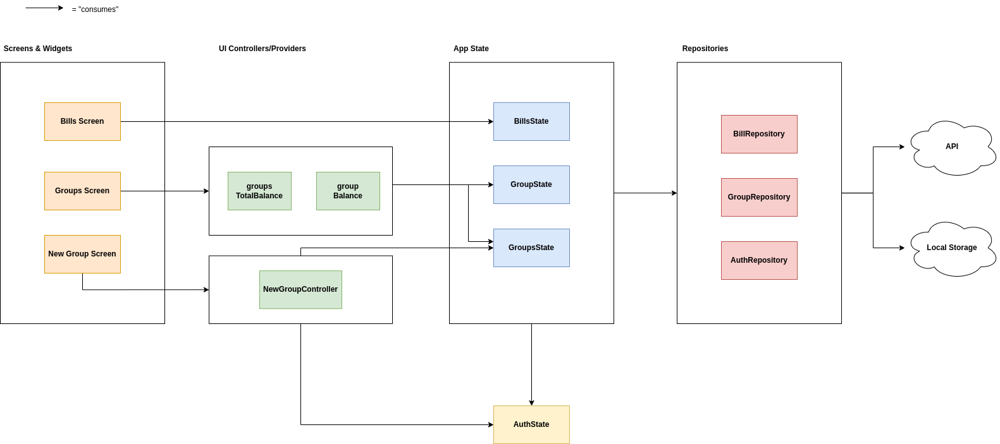

# Split The Bill

# Developer Get Started
**1. Install Flutter**
- follow the instructions: https://docs.flutter.dev/get-started/install

**2. Clone the repository**

**3. Run `fluter pub get` in the root folder**

**4. Run `dart run build_runner watch -d` in the root folder** (needed for code generation, has to always run while development)

**5. Hide nested (generated) files:**:
- click Shift twice
- type `File nesting` and click Enter
- add `; .g.dart;` to Child File Suffix for `.dart` File Suffix

**6. Install plugins (Android Studio):**
- Dart
- Dart Data Class
- Flutter
- Flutter Riverpod Snippets

# Used packages
- **http**: for making HTTP requests
- **go_router**: declarative routing package
- **flutter_riverpod**: state management & DI
- **riverpod_annotation**: annotations for Riverpod code generation
- **riverpod_generator**: code generation package for Riverpod
- **riverpod_lint**: linting package providing additional lint rules for Riverpod
- **build_runner**: build system that automates the code generation

# Architecture
The architecture leverages Riverpod for a modular approach.

### Screens & Widgets:
- Each viewable page has its own folder structured according to app navigation (i. e. `presentation/groups/group_item`)
- Pages have a `_screen.dart` file and may include widgets
- Screens may consume UI controllers/providers for side effects or page-specific computations
- Screens may directly consume from the App State if no side effects are needed (see `BillsScreen`)

### UI Controllers/Providers:
- Realized as Riverpod state notifiers or simple providers
- Found in the same folder as the screen in a `controllers.dart` file
- Used by screens for handling side effects or computing page-specific information

### App State:
- State notifiers representing the overall application state
- Consume one or more repositories
- Different states do not communicate with each other, except for AuthState, which can be accessed by other states

### Repositories:
- Singletons provided by Riverpod
- Interact with external APIs or local mobile storage
- Consumed by one or more app states

### Communication Rules:
App State & repositories do not communicate with each other.

**Exception**: AuthState provides data of the logged user, and other states can access Auth State (but not vice versa).
